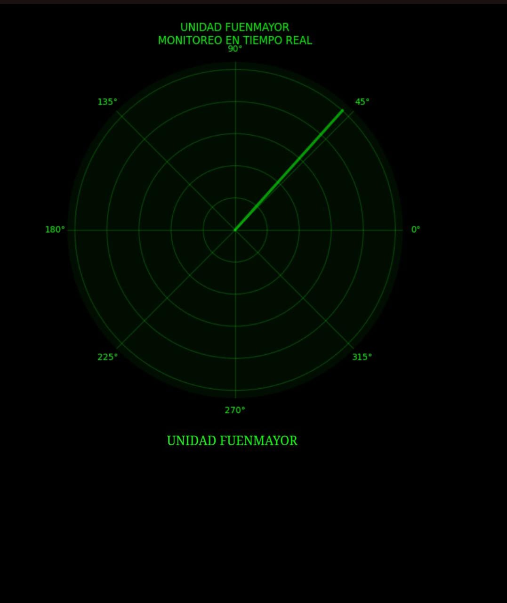
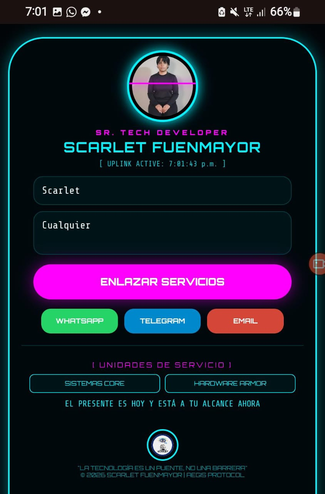
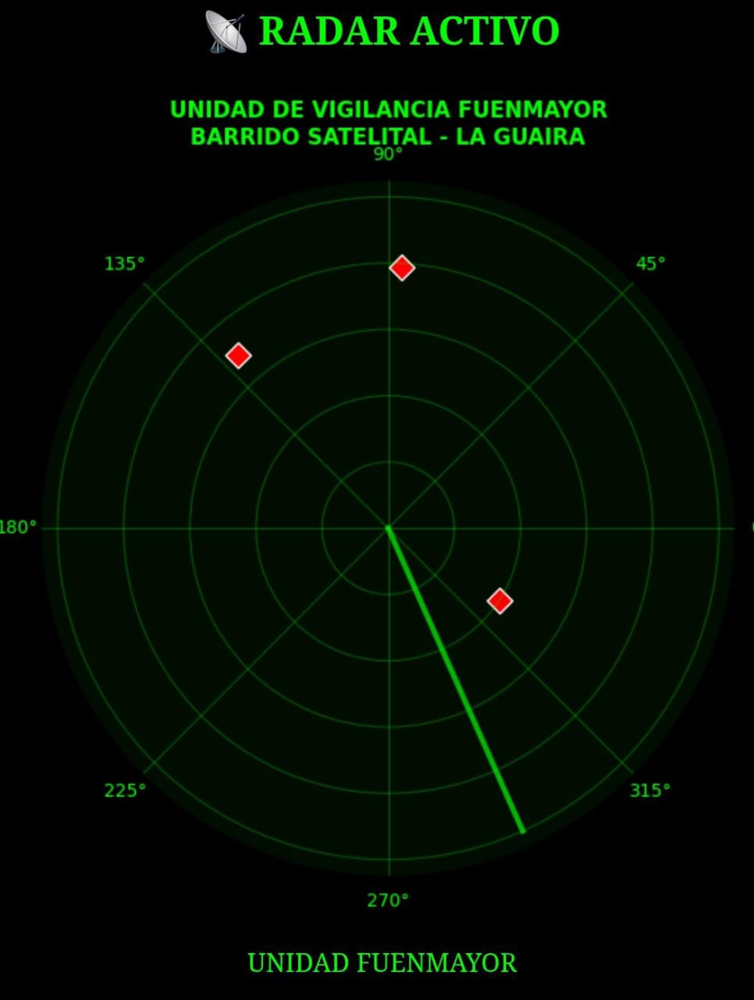
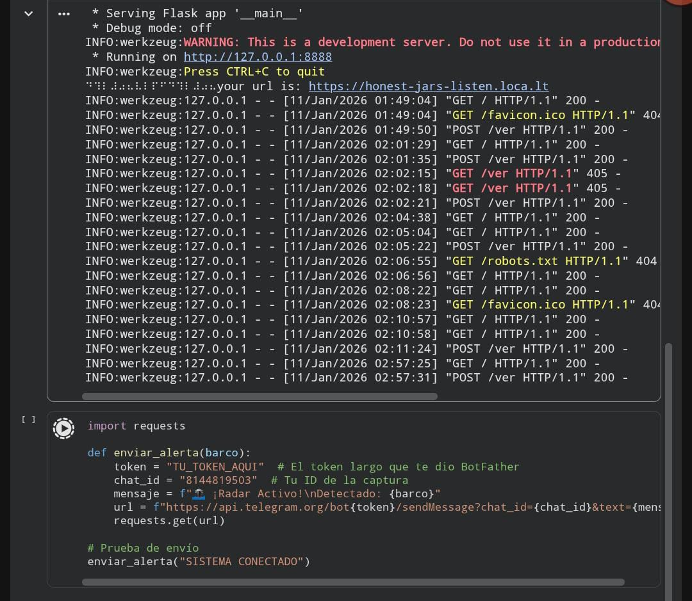

  

## 
💻 SR. TECH DEVELOPER | PROTOCOLO AEGIS 🛡️

   
   
  

---

### 📡 NÚCLEO OPERATIVO
> "Transformando la complejidad técnica en soluciones fluidas bajo el blindaje del Protocolo AEGIS."

* **🛰️ System Security:** Blindaje y recuperación de entornos críticos.
* **🛠️ Hardware Armor:** Diagnóstico avanzado y mantenimiento de élite.
* **🌐 Cloud Support:** Despliegue y optimización de servicios remotos.

---

### 🛡️ HARDWARE ARMOR (REGISTROS TÉCNICOS)

  
  

  
  

---

### 📊 ESTADO DEL SISTEMA

  
  

---

### 📞 CONEXIÓN DIRECTA

  <a href="https://wa.me/584262271349?text=Hola%20Scarlet,%20solicito%20activar%20el%20Protocolo%20AEGIS."><b>[ WHATSAPP ]</b></a> │ 
  <a href="https://t.me/AegisSystem_Bot"><b>[ TELEGRAM ]</b></a> │ 
  <a href="mailto:fuenmayorscarlet610@gmail.com"><b>[ EMAIL ]</b></a>

  © 2026 Scarlet Fuenmayor | AEGIS PROTOCOL | Caracas, Venezuela

